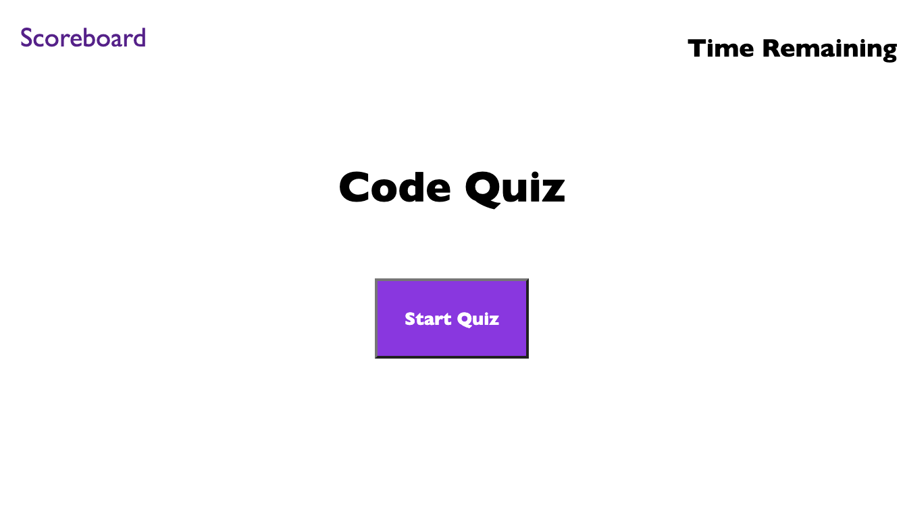
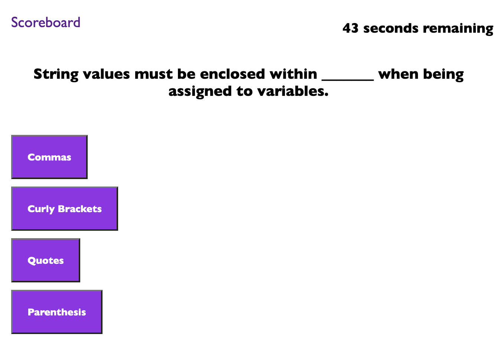
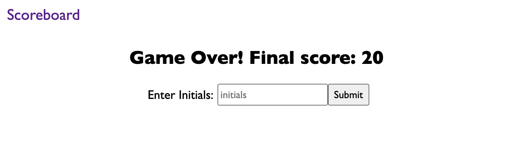
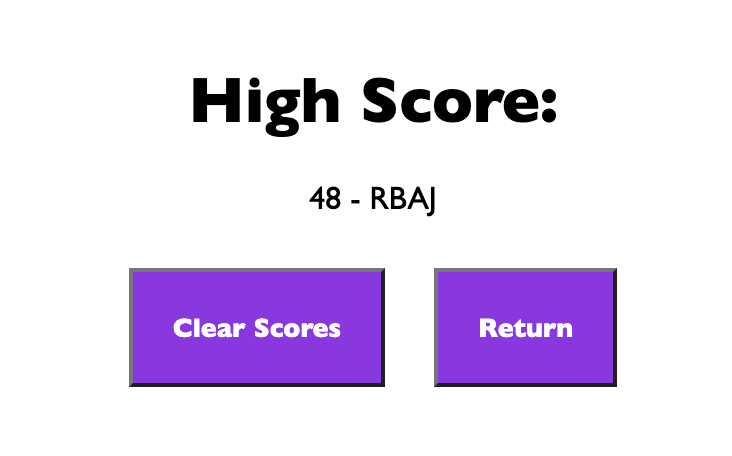

# quiz-assignment

## Client Ask

AS A coding boot camp student

I WANT to take a timed quiz on JavaScript fundamentals that stores high scores

SO THAT I can gauge my progress compared to my peers

## What the Application Does

When the user clicks the Start Quiz button, a timer starts in the top right corner

The user is then prompted with a question and 4 choices

If the correct answer is chosen, the next question is displayed with no penalty

If the incorrect answer is chosen, the next question is displayed but there is a penalty of a 10 second reduction from the time remaining

After the questions are all done, the user's final score is displayed and they are prompted to enter their initials

After entering their initials the user is taken to the high scores page where the highest score is displayed with the appropriate initials

The high score is saved and viewable any time by clicking the Scoreboard link in the top left of the home screen

The user then has the option to return to the home screen as well as the ability to clear scores

## Screenshots of Deployed Application

## Deployed Application URL

https://randronaco1027.github.io/quiz-assignment/